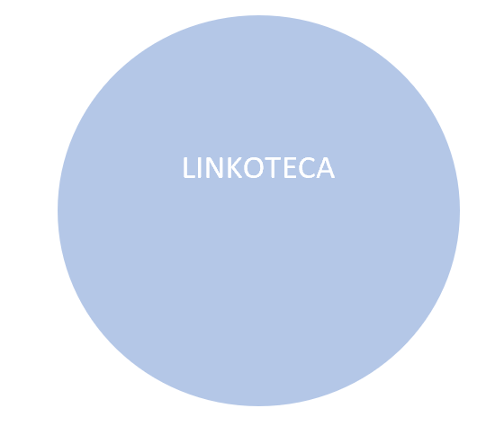
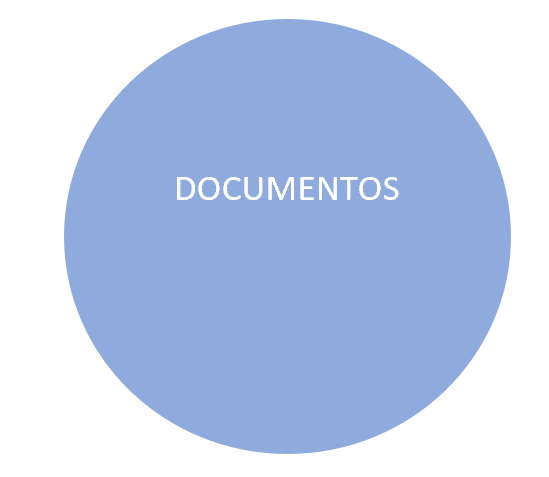
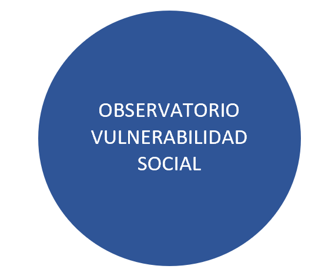
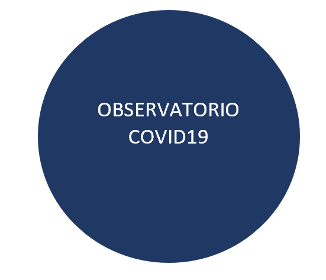

<br />

        
   
<br />
    <br />
        <br />
            <br />
                <br />
                    <br />
                        <br />


La unidad de métodos y acceso a datos busca aportar a la difusión de conocimiento e información respecto al coronavirus y al COVID19. Para ello desplegamos cuatro acciones simultáneas que esperamos sean de utilidad para las comunidades académicas, los tomadores de decisión y los formadores de opinión, así como el público en general. El propósito de este sitio es consolidar en un único espacio un conjunto de recursos globales, regionales y nacionales, así como un conjunto de análisis, visualizaciones e indicadores seleccionados en materia estadística y registral del COVID19. El sitio aporta información sobre  aspectos sociales clave para nuestro país y sobre medidas de confinamiento y su impacto en el comportamiento real de las personas representado en indicadores que desde la UMAD hemos procesado y ordenado para un lectura rápida y abarcativa de la evidencia. Este sitio nos ofrece asimismo la posibilidad de ingresar en otros espacios de producción y visualización de datos que han sido desarrollados por la comunidad académica internacional, regional y nacional.

Las bases de datos y visulizaciones contenidas en el sitio son actualizadas de forma continua para permitir un seguimiento de la evolución de la pandemia en el país en perspectiva comparada. 


<br />
    <br />
        <br />

  
[</a>](https://umad-fcs.github.io/COVID19UY/linkoteca.html)
[</a>](https://umad-fcs.github.io/COVID19UY/documentos.html)
[</a>](https://umad-fcs.github.io/COVID19UY/observatorio_social.html)
[</a>](https://umad-fcs.github.io/COVID19UY/observatorio_covid.html)  


<br />
    <br />
        <br />
            <br />
            <br />
            <br />
            <br />
            <br />
            <br />
            <br />
            <br />


```{r, echo = F}
source("R/utils.R")
```

```{r, echo = FALSE, fig.height = 3, fig.width = 9.5}
ggplotly(g) %>% config(displayModeBar = FALSE)
```

```{r, echo = FALSE, fig.height = 6, fig.width = 9.5,}
datos <- google_uy(datos = busca_data("^Global"))
colores_uy <- c("Parques"  = "#5277F8", 
                "Trabajo"  = "#F5615F")
f <- 
  datos %>% filter(Movilidad %in% c('Parques', 'Trabajo')) %>% 
  ggplot(aes(x = Fecha, y = Valor)) + 
  geom_line(aes(color = Movilidad)) +
  facet_wrap(~departamento) +
  scale_colour_manual(values = colores_uy) +
  theme_minimal() +
  geom_hline(yintercept = 0, color = "gray") +
  labs(x = "", 
       y = "", 
       title = "Movilidad en <span style='color:#5277F8'>parques</span> y <span style='color:#F5615F'>lugares de trabajo</span> seg\u00fan Google (Uruguay y los 19 departamentos)"
       ) +
  theme(
        plot.title = element_markdown(lineheight = 1.1),
        legend.text = element_markdown(size = 11),
        legend.position = "none"
    )

ggplotly(f) %>% config(displayModeBar = FALSE)

```


