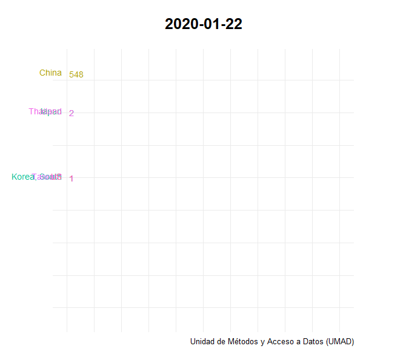
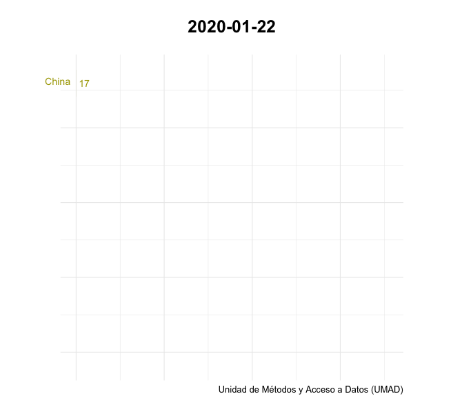
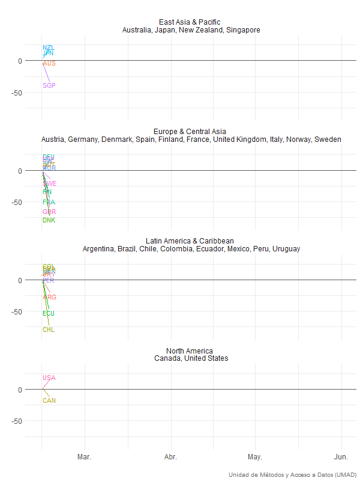
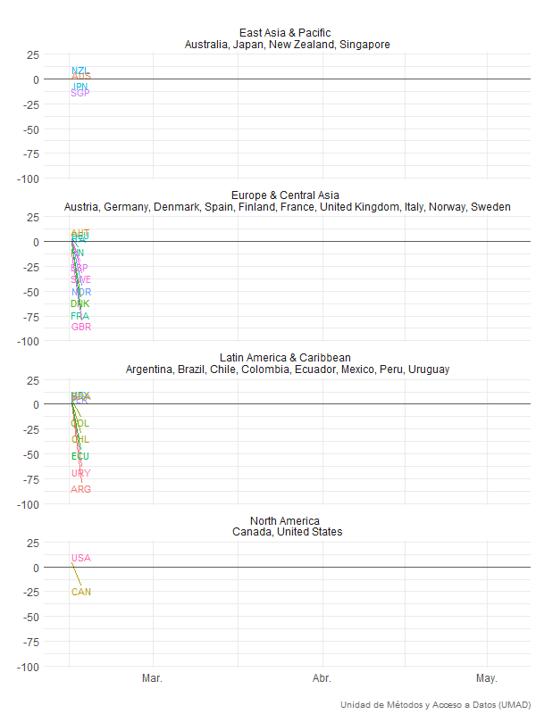
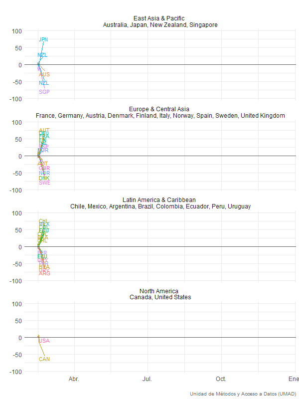
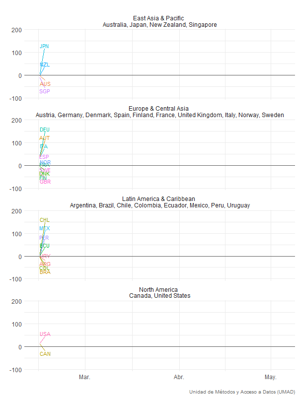
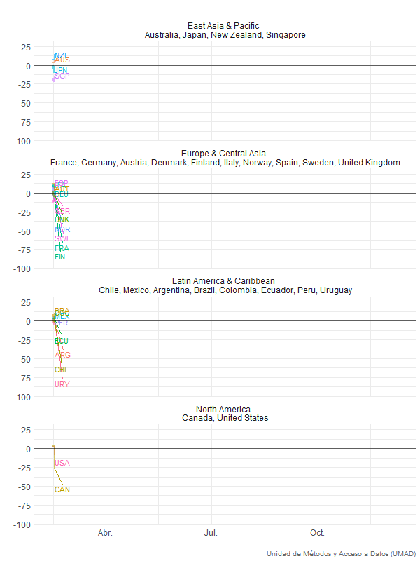
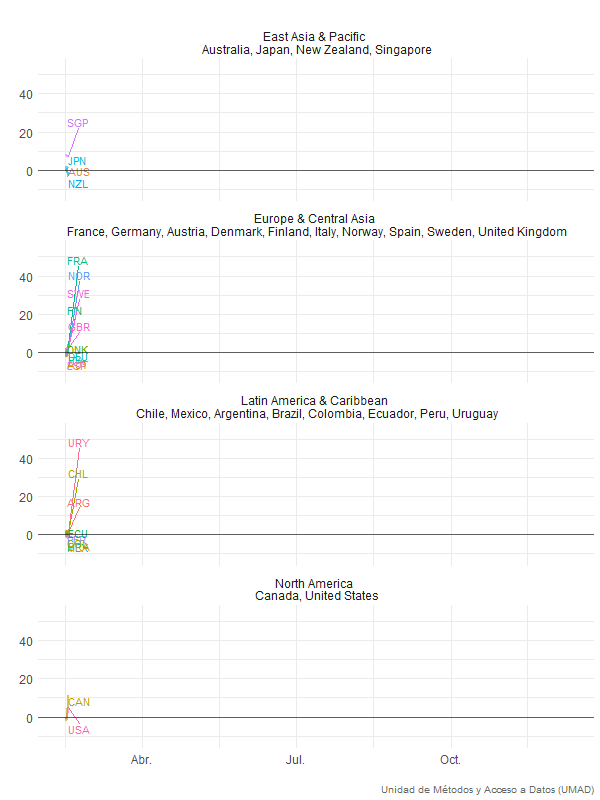

```{r setup, include=FALSE}
knitr::opts_chunk$set(echo = FALSE, warning = FALSE)
```


```{r, warning=F, message=F, error=F, comment=FALSE}
library(tidyverse)
library(knitr)
library(kableExtra)
library(ggthemes)
library(RColorBrewer)
library(ggridges)
library(extrafont)
library(lubridate)
library(colorspace)
library(plotly)
library(stringi)

```

```{r}
## ~~~~~~~~~~~~~~~~~~~~~~~~~~~~~~~~~~
## CARGA DE DATOS
## ~~~~~~~~~~~~~~~~~~~~~~~~~~~~~~~~~~

# SE CARGA DATA DE --> 'PAQUETE TIDYCOVID MERGEADA'
data_hoy <- list.files(path = here::here('data-raw'), pattern = "*.xlsx")
covid_m<- tibble::as_tibble(
    rio::import(here::here('data-raw', data_hoy[length(data_hoy)]))
)

# SE CARGA DATA DE --> 'Uruguay GUIAD-COVID'
data_uy <- list.files(path = here::here('data-raw'), pattern = "^A_guiad")
data_pasteur <- tibble::as_tibble(
    rio::import(here::here('data-raw', data_uy[length(data_uy)]))
)

# SE CARGA DATA DE -->'Uruguay GUIAD-COVID SUBNACIONAL'
depuy<- read.csv("https://raw.githubusercontent.com/GUIAD-COVID/datos-y-visualizaciones-GUIAD/master/datos/estadisticasUY_porDepto_detalle.csv", header=TRUE)

depuy <- depuy %>% 
    mutate(fecha = as.Date(lubridate::parse_date_time(fecha, order = "dmy")), 
           deptos = stringi::stri_sub(depuy$departamento, 1,-9), 
           deptos = stringr::str_squish(
               ifelse(grepl(pattern = "^Paysa", x = deptos), "Paysand\u00fa", 
                                 ifelse(grepl(pattern = "Negro", x = deptos), "R\u00edo Negro",
                                        ifelse(grepl(pattern = "^San", x = deptos), "San Jos\u00e9", 
                                               ifelse(grepl(pattern = "^Tacuarem", x = deptos), "Tacuaremb\u00f3", deptos))))
               ))


```


```{r, warning=F, message=F, error=F, comment=FALSE}
###cambio formato data_uy
data_pasteur<-data_pasteur %>% 
  mutate(Cant.casos.nuevos = as.double(cantCasosNuevos),
         fecha = as.Date(lubridate::parse_date_time(fecha, order = "dmy")),
         cantPersonasConInfeccionEnCurso=as.double(cantPersonasConInfeccionEnCurso),
         acumCasos = as.double(acumCasos),
         cantCTI = as.double(cantCTI),
         cantCI = as.double(cantCI),
         cantRecuperados = as.double(cantRecuperados),
         acumRecuperados = as.double(acumRecuperados),
         cantTest = as.double(cantTest),
         acumTest = as.double(acumTest)
)
         
```

# **Introducción** 

Esta sección permite al usuario acceder a un conjunto de gráficos nacionales y comparados relativos a la evolución de la pandemia COVID19, a links nacionales e internacionales que presentan esta y otra información y a la base de datos integrada que desde la UMAD se ha consolidado combinando bases globales ya estructuradas con los datos de Uruguay presentes en los reportes oficiales y en el monitor del Instituto Pasteur. Los datos incluyen además de los casos, casos críticos, fallecimientos, recuperados y tests realizados, datos relativos a las medidas que el gobierno uruguayo ha tomado para la contención primero y mitigación luego de la pandemia, así como datos para países y regiones seleccionadas. Finalmente, se presentan datos sobre la movilidad real de las personas a diferentes ámbitos (recreación, parques, trabajo, transportes, etc) con base en los reportes desarrollados desde la plataforma de “google mobility”. El propósito de este espacio es disponibilizar a los usuarios un conjunto de recursos para informar y permitir el acceso a fuentes para el análisis nacional y comparado. 


# **Uruguay** 

### _Acumulado de casos confirmados_

Presenta el acumulado de todos los casos confirmados a nivel nacional desde la segunda semana de abril. No se presentan datos previos ya que hasta la primera semana de abril los registros eran inconsistentes, marcando en algunos casos los test positivos y en otros días los casos positivos. La evolución de los casos aquí presentados no representa la cantidad real de casos en el país. Esa cifra no se conoce, aunque para quienes tengan interés en profundizar en la misma les sugerimos abordar los [documentos](https://umad-fcs.github.io/COVID19UY/documentos.html) en la sección sobre recursos metodológicos en donde se han procurado realizar estimaciones de las tasas de prevalencias reales en el país y en otros países del mundo a partir de diversos modelos y fuentes de datos 

```{r, warning=F, message=F, comment=FALSE}
#1. Casos de Uruguay acumulativo línea de tiempo
data_pasteur%>% 
  ggplot(aes(x = fecha, y = acumCasos)) + 
  geom_col(position = position_dodge(width = 0.8), fill="#56B4E9") +
  geom_text(aes(label = acumCasos), vjust = 0.4, hjust = 1.2, size = 2, vjust = 2, angle = 90) +
  scale_y_continuous() +
  labs(x = "",
       y = "Cantidad de casos",
       title = "",#Acumulado de casos confirmados
       caption = 'Unidad de Métodos y Acceso a Datos (UMAD)') +
  theme_minimal()

```

### _Acumulado de personas fallecidas_

Los datos reflejan las muertes confirmadas como derivadas del COVID19. Los criterios para asignar un fallecimiento a la enfermedad pueden variar entre países. Por otra parte, pueden darse situaciones en donde un fallecimiento –especialmente si es fuera del ámbito hospitalario- debido a COVID19 no es registrado como tal. Para quienes quieran ahondar en metodologías que procuran estimar las muertes por COVID19 recomendamos visitar [EuroMomo](https://www.euromomo.eu) en donde se trabaja con estadísticas sobre “excess mortality”. Lamentablemente en Uruguay no hemos podido acceder a los registros de muertes semanales o mensuales de los años 2019 y 2018 lo que ofrecería un parámetro para evaluar los excesos de muerte (o no) desde el 13 de marzo a la fecha en comparación a años anteriores en el mismo período. 

```{r, warning=F, message=F, comment=FALSE}
#2. Muertes en Uruguay acumulativo linea de tiempo
data_pasteur %>% 
  ggplot(aes(x = fecha, y = acumFallecidos)) + 
  geom_col(position = position_dodge(width = 0.8), fill = "#56B4E9") + 
  geom_text(aes(label= ifelse(acumFallecidos > 0, acumFallecidos, "")), 
            position = position_dodge(0.9), 
            size = 2, 
            vjust = 2)+
  scale_y_continuous()+
  labs(x = "",
       y = "Cantidad de personas",
       title = "",#Acumulado de personas fallecidas
       caption = 'Unidad de Métodos y Acceso a Datos (UMAD)')+
  theme_minimal()
```

### _Acumulado de personas con infecciones activas_

Este dato surge de restar el acumulado de nuevos casos menos el acumulado de pacientes recuperados (dados de alta) y fallecidos. Nuevamente, teniendo en cuenta las limitaciones registrales este dato es de suma importancia para evaluar la presencia del virus en la sociedad. La apuesta clave de los gobiernos es que la tasa de variación de el acumulado de personas con infecciones activas sea, luego de la primera etapa de expansión, negativa, liderada por el aumento de casos recuperados y la merma o estabilidad de nuevos casos y se sostenga con tal signo en el tiempo. 

```{r, warning=F, message=F, comment=FALSE}
#3. Casos Activos en Uruguay acumulativo línea de tiempo
data_pasteur%>% 
  ggplot(aes(x=fecha, y=cantPersonasConInfeccionEnCurso)) + 
  geom_col(position = position_dodge(width = 0.8), fill = "#56B4E9") + 
  geom_text(aes(label=cantPersonasConInfeccionEnCurso), 
            vjust = 0.4, hjust = 1.2, size = 2, vjust = 2, angle = 90)+
  scale_y_continuous()+
  labs(x = "",
       y = "Cantidad de con infecciones activas",
       title = "",#Acumulado de personas con infecciones activas
       caption = 'Unidad de Métodos y Acceso a Datos (UMAD)')+
  theme_minimal()
```

### _Acumulado de casos recuperados_

Este dato surge de considerar todos los casos confirmados que han cursado la enfermedad y han sido dados de alta. Para nuestro país el criterio utilizado para dar de alta a un paciente COVID19 es 14 días continuos con ausencia de sintomatología. Si bien el modo ideal de determinar el alta es la realización de un test de detección, por razones de prioridad ello sucede solamente en algunos casos. Otros países solo determinan el alta con dichos tests realizados. 

```{r, warning=F, message=F, comment=FALSE}
#4. Recuperados en Uruguay cumulativo línea de tiempo
data_pasteur%>% 
  ggplot(aes(x=fecha, y=acumRecuperados)) + 
  geom_col(position = position_dodge(width = 0.8), fill = "#56B4E9") + 
  geom_text(aes(label=acumRecuperados), 
            vjust = 0.4, hjust = 1.2, size = 2, vjust = 2, angle = 90)+
  scale_y_continuous()+
  labs(x = "",
       y = "Cantidad de personas recuperadas",
       title = "",#Acumulado de personas recuperadas
       caption = 'Unidad de Métodos y Acceso a Datos (UMAD)')+
   theme_minimal()

```

### _Personas infectadas por día_

En rigor este gráfico mide el número de personas que recibieron un resultado positivo en cada día. Debido a que existe una demora entre la realización del test y los resultados de entre 1 y 3 días, los casos diarios miden los resultados positivos cada día y no el número de infectados cada día. Aún con estas salvedades la serie permite un seguimiento adecuado de los casos detectados por día.

```{r, warning=F, message=F, comment=FALSE}
#5. Casos nuevos por dia línea de tiempo
data_pasteur%>% 
  ggplot(aes(x=fecha, y=Cant.casos.nuevos)) + 
  geom_col(position = position_dodge(width = 0.8), fill="#56B4E9") + 
  geom_text(aes(label=Cant.casos.nuevos), 
            position = position_dodge(0.9), 
            size = 2, 
            vjust = 2) +
  scale_y_continuous() +
  labs(x = "",
       y = "Cantidad de personas infectadas",
       title = "",#Personas infectadas por día
       caption = 'Unidad de Métodos y Acceso a Datos (UMAD)') +
  theme_minimal()
  
```

### _Cronograma de número de fallecidos_

La presente ilustración identifica para cada día la existencia o no de fallecimientos y la cantidad de fallecidos. No es una figura acumulativa, sino simplemente los registros de fallecimientos para cada día de la cronología. 

```{r, warning=F, message=F, comment=FALSE, fig.height=7}
#6. Muertes nuevas por día línea de tiempo (horrible)

data_pasteur %>% 
ggplot(aes(x = fecha, y = cantFallecidos)) +
  geom_point(color="#56B4E9") + 
  scale_y_continuous(breaks = data_pasteur$cantFallecidos) +
  scale_x_date(breaks = "days", date_labels =  "%b %d") +
  coord_flip() +
  labs(x = "",
       y = "Cantidad de personas",
       title = "",#Personas fallecidas por día
       caption = 'Unidad de Métodos y Acceso a Datos (UMAD)') +
  theme_minimal() +
  theme(axis.text.y = element_text(size = 5))

```

### _Personas en Cuidados Intensivos por COVID19_

El siguiente gráfico muestra para cada día la cantidad de personas que se encuentran en unidades de cuidados intensivos debido a complicaciones con el curso de la enfermedad.  Nuevamente, si bien estos son casos confirmados en CTI, a diferencia del número de casos confirmados en general, este indicador (asumiendo una tasa de complicaciones estable) provee no solo un indicador relevante para el cálculo de capacidades hospitalarias y su programación, sino también sobre la prevalencia estimada de la enfermedad en la población.


```{r, warning=F, message=F, comment=FALSE}
#7. Casos críticos (CTI) acumulativo línea de tiempo
data_pasteur%>% 
  ggplot(aes(x=fecha, y=cantCTI)) + 
  geom_col(position = position_dodge(width = 0.8), fill="#56B4E9") + 
  geom_text(aes(label=cantCTI), 
            position = position_dodge(0.9), 
            size = 2, 
            vjust = 2) +
  scale_y_continuous()+
  labs(x = "",
       y = "Cantidad de personas en CTI",
       title = "",#Personas en CTI
       caption = 'Unidad de Métodos y Acceso a Datos (UMAD)') + 
  theme_minimal()

```


### _Personas recuperadas y activas_

Combina la evolución acumulada de personas recuperadas con el registro diario de casos activos (que surge de considerar el total de casos menos los recuperados y los fallecidos). Una curva ascendente del primer indicador y una descendente del segundo marcan un rumbo deseable en la progresión de la epidemia y sus consecuencias. 

```{r, warning=F, message=F, comment=FALSE}
#8. Recuperados, vs activos acumulativos línea de tiempo
data_pasteur %>%
  ggplot(aes(x = fecha))+
  geom_line(aes(y=cantPersonasConInfeccionEnCurso, color="Casos Activos"), size = 1.5) +
  geom_line(aes(y=acumRecuperados, color="Personas recuperadas"), size = 1.5) +
  labs(x = "",
       color = "", 
       y = "Cantidad de personas ",
       title = "",
       caption = 'Unidad de Métodos y Acceso a Datos (UMAD)') +
  theme_minimal()
  
```

### _Personas recuperadas y muertes_

Marca la evolución combinada de ambas situaciones. La tasa de fatalidad de casos (Case Fatality Rate, o CFR por sus siglas en inglés) surge de esta combinación. Se suman ambos indicadores y se divide el acumulado de fallecidos cada día por el acumulado de casos totales cada día o como se acostumbra hacer con un delay de siete a diez días dado lo que se conoce como el curso problemático de la enfermedad (o CFR corregida). Nuevamente, se espera una curva ascendente dominante de los casos recuperados sobre las fatalidades que amplia en su progresión la brecha entre casos recuperados y fallecimientos. De producirse un aumento sistemático de la brecha positiva a favor de los casos recuperados sobre los fallecidos, ello estaría indicando una caída en la letalidad de casos o inversamente un mejoramiento en las tasas de recuperación.  Estos indicadores nuevamente no deben confundirse con la tasa de letalidad verdadera, ya que en rigor se desconoce el denominador real, ni con la tasa de letalidad poblacional, que sí surge del total de fallecidos sobre parámetros poblacionales generales. 

```{r, warning=F, message=F, comment=FALSE}
#9. Muertes vs Recuperados acumulativos línea de tiempo
data_pasteur%>%
  ggplot(aes(x = fecha)) +
  geom_line(aes(y = acumFallecidos, color="Personas fallecidas"), size = 1.5) +
  geom_line(aes(y = acumRecuperados, color="Personas recuperadas"), size = 1.5) +
  labs(x = "",
       color = "", 
       y = "Cantidad de personas",
       title = "",
       caption = 'Unidad de Métodos y Acceso a Datos (UMAD)') + 
  theme_minimal()

```

### _Tests realizados por día_

En rigor son tests procesados y con resultados por día ya que entre el hisopado y el resultados del test puede existir una demora de entre 24 hs y cuatro días en la mayor parte de los países. Por ello los resultados de dichos tests no están indicando la cantidad de infecciones de cada día, sino la de un período anterior. Considerando la evolución clínica de la enfermedad y la demora entre hisopados y resultados, esta fotografía que observamos en el día puede representar la realidad de entre 5 y 9 días previos. Nuevamente, es importante no confundir las fechas en que las mediciones arrojan datos, con las fechas de las realidades que reflejan. Idealmente los tests realizads por día debieran presentar una curva ascendente ya que tanto para una mejor captación de la prevalencia, como para la definción de las estrategias epidemiológicas de mitigación y control una adecuada capacidad de testeo es fundamental. La cantidad de tests por día reflejan tanto los criterios que se definen en los protocolos médicos para habilitar la realización de los tests como la capacidad de infaestructra y logística de los países. La realización de tests aleatorios o tests masivos a ciertas poblaciones de riesgo son estrategias utilizadas crecientemente en varios países que requieren de capacidades muy altas de testeo a nivel nacional. 

```{r, warning=F, message=F, comment=FALSE}
#10. Tests por día línea de tiempo
data_pasteur%>% 
  ggplot(aes(x=fecha, y=cantTest)) + 
  geom_col(position = position_dodge(width = 0.8), fill = "#56B4E9") + 
  geom_text(aes(label=cantTest), 
            vjust = 0.4, hjust = 1.2, size = 2, vjust = 2, angle = 90) +
  scale_y_continuous() +
  labs(x = "",
       y = "Cantidad de Test",
       title = "",
       caption = 'Unidad de Métodos y Acceso a Datos (UMAD)') +
  theme_minimal()

```


### _Tests acumulados por día_

La curva refleja simplemente el total de tests que se han realizado en el país. 


```{r,warning=F, message=F, comment=FALSE}
#11. Tests acumulativos línea de tiempo
data_pasteur%>% 
  ggplot(aes(x = fecha, y = acumTest)) + 
  geom_col(position = position_dodge(width = 0.8), fill = "#56B4E9") + 
  geom_text(aes(label = acumTest), 
            vjust = 0.4, hjust = 1.2, size = 2, vjust = 2, angle = 90) +
  scale_y_continuous() +
  labs(x = "",
       y = "Cantidad de Test",
       title = "",
       caption = 'Unidad de Métodos y Acceso a Datos (UMAD)') +
  theme_minimal()

```

### _Tasa de crecimiento de casos totales_

Surge de considerar la variación día a día de los casos totales. Un valor del 5% indica simplemente que respecto a 100 casos en *t0* se identificaron 5 casos adicionales y por tanto 105 casos en *t1*. Cuanto menor y más decreciente sea la tasa de crecimiento más esperable es que el total de casos activos tienda a cero si las tasas de recuperación se mantienen estables. 

```{r, warning=F, message=F, comment=FALSE}
#12. Tasa de crecimiento de casos totales
data_pasteur%>% 
  mutate(crec_casos = acumCasos - lag(acumCasos), 
  crec_porc = (crec_casos/lag(acumCasos)*100)) %>%
  ggplot(aes(x=fecha, y=crec_porc)) + 
  geom_col(position = position_dodge(width = 0.8), fill="#56B4E9") + 
  geom_text(aes(label=round(crec_porc, 1)), 
            vjust = 0.4, hjust = 1.2, size = 2, vjust = 2, angle = 90) +
  scale_y_continuous() +
  labs(x = "",
       y = "Tasa de crecimiento",
       title = "",
       caption = 'Unidad de Métodos y Acceso a Datos (UMAD)') +
  theme_minimal()

```

```{r, warning=F, message=F, comment=FALSE}
#13. Tasa de crecimiento de muertes totales
# data_pasteur%>%
#   mutate(crec_casos = acumFallecidos - lag(acumFallecidos),
#   crec_porc = (crec_casos/lag(acumFallecidos)*100),
#   deaths_rate = case_when(deaths_rate = crec_porc < 100 ~ crec_porc, TRUE~NaN)) %>%
#   ggplot(aes(x = fecha, y = deaths_rate)) +
#   geom_col(position = position_dodge(width = 0.8), fill = "#56B4E9") +
#   geom_text(aes(label= ifelse(deaths_rate > 0, round(deaths_rate, 1), "")),
#             position = position_dodge(0.9),
#             size = 2,
#             vjust = 2) +
#   scale_y_continuous()+
#   labs(x = "",
#        y = "Tasa de crecimiento de muertes totales",
#        title = "Tasa de crecimiento muertes",
#        caption = 'Unidad de Métodos y Acceso a Datos (UMAD)')+
#   theme_minimal()

```

### _Tasa de variación de casos recuperados acumulados y casos acumulados_

Esta tasa surge de restar los casos acumulados a los casos recuperados acumulados y dividirlo por el total diaría de casos acumulados. Por ello el valor es negativo y lo será siempre. El comportamiento deseable de esta tasa es su aproximación al valor cero. En su forma extrema ello ocurriría cuando los casos recuperados acumulados igualaran a los casos acumulados. Para ello se requeriría que los casos acumulados dejen de crecer y que no existan fallecimientos. Como ello no es posible (ya que existen ya casos de fallecimiento) el valor que surgiría de una tendencia hacia cero crecimiento de casos acumulados y progresión de casos recuperados arrojaría finalmente algo aproximado a la tasa de fatalidad de casos identificados. 

```{r, warning=F, message=F, comment=FALSE}
#14. Tasa de VARIACION de recuperados cada dia sobre casos cada día
data_pasteur%>% 
 mutate(crec_prop_rec = (acumRecuperados-acumCasos)/ acumCasos*100) %>%
  ggplot(aes(x=fecha, y=crec_prop_rec)) + 
  geom_col(position = position_dodge(width = 0.8), fill = "#56B4E9") + 
  geom_text(aes(label = round(crec_prop_rec, 1)), 
            vjust = 0.4, hjust = 1.2, size = 2, vjust = 2, angle = 90) +
  scale_y_continuous() +
  labs(x = "",
       y = "Tasa de variación recuperados/casos nuevos",
       title = "",
       caption = 'Unidad de Métodos y Acceso a Datos (UMAD)') +
  theme_minimal()
```

### _Tasa de variación de tests realizados_

Muestra la variación día a día de los tests acumulados realizados. Es normal que las tasa de variación de de tests acumulados por dia decrezca en el tiempo ya que en la medida en que aumentan los tests acumulados la necesaria variación absoluta para mantener una tasa relativa uniforme de crecimiento aumenta. 

```{r, warning=F, message=F, comment=FALSE}
#15. Tasa de VARIACIÓN de tests totales
data_pasteur%>% 
  mutate(crec_casos = acumTest - lag(acumTest), 
  crec_porc = (crec_casos/lag(acumTest)*100),
  test_rate=case_when(test_rate = crec_porc <100 ~ crec_porc, 
                        TRUE~NaN)) %>%
  ggplot(aes(x=fecha, y=test_rate)) + 
  geom_col(position = position_dodge(width = 0.8), fill="#56B4E9") + 
  geom_text(aes(label= ifelse(test_rate>0, round(test_rate, 1), "")), 
            vjust = 0.4, hjust = 1.2, size = 2, vjust = 2, angle = 90) +
  scale_y_continuous() +
  labs(x = "",
       y = "Variación %",
       title = "",
       caption = 'Unidad de Métodos y Acceso a Datos (UMAD)')+
  theme_minimal()

```

# **Uruguay por departamentos**

<!-- ### _Casos confirmados_ -->

```{r}
# depuy %>%
#   ggplot(aes(x = fecha, y = cantCasosNuevos)) +
#   geom_bar(stat = "identity", position = "identity", fill= "#56B4E9") +
#   labs(x = "",
#        color="",
#        y = "Cantidad de casos",
#        title ="Casos nuevos") +
#   theme_minimal()+
#   theme(legend.position = "none")+
#   facet_wrap(vars(deptos))
```

### _Acumulado de casos confirmados_
```{r}

g<-depuy %>% 
  rename(Fecha=fecha, Confirmados= acumCasos)%>%
  ggplot(aes(x = Fecha, y = Confirmados)) +
  geom_bar(stat = "identity", position = "identity", fill= "#56B4E9") +
  labs(x = "",
       color="",
       y = "Cantidad de casos",
       title ="") +
  theme_minimal()+
  theme(legend.position = "none", axis.text.x = element_text(size = 6))+
  #geom_text(aes(label = enCurso), vjust = 0.4, hjust = 1.2, size = 2, vjust = 2, angle = 90)+
 facet_wrap(vars(deptos))

ggplotly(g) %>% config(displayModeBar = F) %>%
    layout(margin = list(b = 140), legend = list(x = 0.5, y = -0.1, orientation = "h", xanchor = "center" ))%>%
    add_annotations(xref = "paper",
                    yref = "paper",
                    x = 1, 
                    y = -0.3, 
                    showarrow = FALSE,
                    text='Unidad de Métodos y Acceso a Datos (UMAD)', font = list(color = "black", size = 12))

```


### _Casos activos_
```{r}
g<-depuy %>% 
   rename(Fecha=fecha, Activos= enCurso)%>%
  ggplot(aes(x = Fecha, y = Activos)) +
  geom_bar(stat = "identity", position = "identity", fill= "#56B4E9") +
  labs(x = "",
       color="",
       y = "Cantidad de casos",
       title ="") +
  theme_minimal()+
  theme(legend.position = "none", axis.text.x = element_text(size = 6))+
  #geom_text(aes(label = enCurso), vjust = 0.4, hjust = 1.2, size = 2, vjust = 2, angle = 90)+
 facet_wrap(vars(deptos))

ggplotly(g) %>% config(displayModeBar = F) %>%
    layout(margin = list(b = 140), legend = list(x = 0.5, y = -0.1, orientation = "h", xanchor = "center" ))%>%
    add_annotations(xref = "paper",
                    yref = "paper",
                    x = 1, 
                    y = -0.3, 
                    showarrow = FALSE,
                    text='Unidad de Métodos y Acceso a Datos (UMAD)', font = list(color = "black", size = 12))


```

### _Cronograma de fallecimientos_

```{r}
g<-depuy %>% 
   rename(Fecha=fecha, Fallecidos= cantFallecidos)%>%
   ggplot(aes(x = Fecha, y = Fallecidos)) +
  geom_point(color="#56B4E9", size= 0.5) + 
  scale_y_continuous(breaks = depuy$cantFallecidos) +
  scale_x_date(breaks = "month", date_labels =  "%b %d",) +
  coord_flip() +
  labs(x = "",
       y = "Cantidad de personas",
       title = "",#Personas fallecidas por día
       caption = 'Unidad de Métodos y Acceso a Datos (UMAD)') +
  theme_minimal() +
  theme(axis.text.y = element_text(size = 6))+
  facet_wrap(vars(deptos))

ggplotly(g) %>% config(displayModeBar = F) %>%
    layout(margin = list(b = 140), legend = list(x = 0.5, y = -0.1, orientation = "h", xanchor = "center" ))%>%
    add_annotations(xref = "paper",
                    yref = "paper",
                    x = 1, 
                    y = -0.3, 
                    showarrow = FALSE,
                    text='Unidad de Métodos y Acceso a Datos (UMAD)', font = list(color = "black", size = 12))

```

# **Uruguay y la región** 

### _Acumulado de casos positivos detectados_

Identifica simplemente la curvas de casos acumulados confirmados. La comparación en este caso no tiene mayor sentido en lo que hace a las cantidades absolutas, aunque si permite ver formas diferentes en las pendientes de las curvas ascendentes. 

```{r, out.width='100%'}
g <- 
  covid_m %>% 
  rename(`país` = country, fecha = date, casos = confirmed)%>%
  filter(`país` %in% c('Argentina', 'Brazil', 'Chile', 'Uruguay')) %>% 
  ggplot(aes(x = fecha, y = casos, color = `país`))+
  scale_y_continuous(labels = function(x) format(x, scientific = FALSE))+
  geom_line() +
  labs(x = "",
       color = "", 
       y = "Cantidad de personas",
       title = "") +
  theme_minimal() 


ggplotly(g) %>% config(displayModeBar = F) %>%
    layout(margin = list(b = 140), legend = list(x = 0.5, y = -0.1, orientation = "h", xanchor = "center" ))%>%
    add_annotations(xref = "paper",
                    yref = "paper",
                    x = 1, 
                    y = -0.3, 
                    showarrow = FALSE,
                    text='Unidad de Métodos y Acceso a Datos (UMAD)', font = list(color = "black", size = 12))
 
  
```


### _Casos acumulados confirmados por millón de habitantes_

Estas son las mismas curvas pero parametrizadas por la población de cada país y expresadas como casos por millón de habitantes. En este caso sí es pertinente la comparación tanto de los niveles o valores como de las pendientes y las curvas. La preferencia absoluta es por curvas que se aplanan y luego dejan de crecer. Ello no sucede por ahora en la región. Sin embargo, es importante distinguir entre países que muestran curvas exponenciales de aquellos que muestran curvas de progresión lineal y cuyas pendientes pueden ser más o menos acentuadas. Es importante también considerar la trayectoria considerando el tiempo transcurrido entre la detección de los primeros casos y la progresión a la fecha. Esto puede realizarse colocando el cursor sobre cualquier punto de la curva lo que nos arrojará el dato del valor de dicha curva y la fecha de dicho valor. 


```{r, out.width='100%'}
#16. Casos por 1 millon de habitantes (Argentina, Chile, Uruguay, Brasil, promedio America del Sur))

g<-covid_m%>%
  filter(country %in% c('Argentina', 'Brazil', 'Chile', 'Uruguay'))%>%
  mutate(confirmedx1m = round(confirmed/population*1000000, 1),
         mean_confirmedx1m = round(mean(confirmedx1m), 1 ))%>%
  select(date, country,confirmedx1m, mean_confirmedx1m)%>%
  gather(key = "variables", value = "valores", -date, -country, -mean_confirmedx1m)%>%
  rename(`país`=country, fecha=date, casos=valores, promedio= mean_confirmedx1m)%>%
  ggplot(aes(x = fecha, y= casos, colour=`país`))+
  geom_line()+
  geom_line(aes(y = promedio), linetype = "twodash", colour = "grey")+
  labs(x = "",
       color = "", 
       y = "Cantidad de casos ",
       title = "")+#Casos confirmados por millón de personas
  theme_minimal()
  
p<-ggplotly(g)%>% config(displayModeBar = F)%>%
    layout(margin = list(b=120), legend=list(x=0.5, y=-0.1,orientation = "h",
                    xanchor = "center" ))%>%
    add_annotations(xref="paper",
                    yref="paper",
                    x=1, 
                    y=-0.3, 
                    showarrow=F,
                    text='Unidad de Métodos y Acceso a Datos (UMAD)', font =              list(color = "black",
          size = 12))

p[["x"]][["data"]][[5]][["text"]] <- paste("promedio:", g$data$promedio, "<br>", 
"fecha:", g$data$fecha, "<br>")
                                         
p
```


### _Muertes por millón de habitantes_

Muestra la evolución de los fallecidos parametrizados por la población de los países. Nuevamente tanto los valores de cada caso como las pendientes son en este caso comparables, aunque nuevamente es importante considerar las fechas o tiempos acaecidos entre la aparición de los primeros casos y su progresión. Como se puede observar los países que presentan más casos por millón de habitantes no son necesariamente los que presentan más muertes por millón de habitantes. Existen muchas potenciales razones para ello, pero una a considerar siempre es la amplitud del testeo en los diferentes países. En general países con alta capacidad de testeo presentan mayor capacidad de captación de casos  y viceversa. Ello puede llevar que países con muchos casos detectados por millón de habitantes presenten menos muertes por millón de habitantes que países con menos casos detectados. La razón en este caso sería que los primeros están más cerca del verdadero denominador que los segundos. 


```{r, out.width='100%'}
#17. Muertes por 1 millon de habitantes ((Argentina, Chile, Uruguay, Brasil, promedio América del Sur)
g<-covid_m%>%
  
  filter(country %in% c('Argentina', 'Brazil', 'Chile', 'Uruguay')) %>%
  
  mutate(deathsx1m = round(deaths/population*1000000, 1),
         mean_deathsx1m = round(mean(deathsx1m), 1) ) %>%
  select(date, country, deathsx1m, mean_deathsx1m) %>%
  gather(key = "variables", value = "valores", -date, -country, -mean_deathsx1m) %>%
  rename(`país` = country, fecha = date, muertes = valores, promedio = mean_deathsx1m) %>%
  ggplot(aes(x = fecha, y= muertes, colour = `país`)) +
  geom_line() +
  geom_line(aes(y = promedio), linetype = "twodash", colour = "grey") +
  labs(x = "",
       color = "", 
       y = "Cantidad de muertes",
       title = "")+ #Muertes por millón de habitantes
  theme_minimal()

p <- 
  ggplotly(g) %>% 
  config(displayModeBar = FALSE) %>%
    layout(margin = list(b = 120), legend = list(x = 0.5, y = -0.1,orientation = "h",
                    xanchor = "center" ))%>%
    add_annotations(xref = "paper",
                    yref = "paper",
                    x = 1, 
                    y = -0.3, 
                    showarrow = FALSE,
                    text = 'Unidad de Métodos y Acceso a Datos (UMAD)', font = list(color = "black",size = 12))

p[["x"]][["data"]][[5]][["text"]] <- paste("promedio:", g$data$promedio, "<br>", "fecha:", g$data$fecha, "<br>")
                                         
p

```


### _Recuperados por millón de habitantes_

Si bien presentamos estas curvas las diferencias en como los países y con que periodicidad definen recuperados y no recuperados hacen compleja una interpretación clara. Igualmente, las curvas muestran pautas similares a las de casos por millón de habitantes sugiriendo tasas de recuperación similares aunque no iguales. 


```{r}
#18. Tests por millón de habitantes (IDEM)
#19. Casos Activos por millon de habitantes
#20. Casos críticos por casos totales línea de tiempo
```

```{r, out.width='100%'}
#21. Recuperados por casos totales línea de tiempo.

g <- 
  covid_m%>%
  filter(country %in% c('Argentina', 'Brazil', 'Chile', 'Uruguay')) %>%
  mutate(recoveredx1m = round(recovered/population*1000000, 1),
         mean_recoveredx1m = round(mean(recoveredx1m, na.rm = TRUE), 1) ) %>%
  select(date, country, recoveredx1m, mean_recoveredx1m) %>%
  gather(key = "variables", value = "valores", -date, -country, -mean_recoveredx1m) %>%
  rename(`país` = country, fecha = date, recuperados = valores, promedio = mean_recoveredx1m)%>%
  ggplot(aes(x = fecha, y= recuperados, colour = `país`)) +
  geom_line() +
  geom_line(aes(y = promedio), linetype = "twodash", colour = "grey") +
  labs(x = "",
       color = "", 
       y = "Cantidad de recuperados", 
       title = "")+ #Recuperados por millón de habitantes
  theme_minimal()

p <- 
  ggplotly(g) %>% 
  config(displayModeBar = FALSE)%>%
    layout(margin = list(b = 120), legend = list(x = 0.5, y = -0.1,orientation = "h",
                    xanchor = "center" ))%>%
    add_annotations(xref = "paper",
                    yref = "paper",
                    x = 1, 
                    y = -0.3, 
                    showarrow = FALSE,
                    text = 'Unidad de Métodos y Acceso a Datos (UMAD)', font = list(color = "black", size = 12))

p[["x"]][["data"]][[5]][["text"]] <- paste("promedio:", g$data$promedio, "<br>", 
"fecha:", g$data$fecha, "<br>")
                                         
p

```


### _Muertes sobre casos totales_

En rigor este indicador mediría la tasa de fatalidad de casos (CFR) aunque sin reconocer el rezago entre casos registrados y ocurrencia de fallecimiento. En cualquier caso muestra una pauta esperable, con niveles altos en el inicio y en la medida que aumentan los casos un aplanamiento o incluso disminución de la curva. Ello responde a que la capacidad ampliada de testeo y de identificación de casos menos graves opera generando un denominador mayor y un numerador menor. El pico extremo de Argentina al inicio surge posiblemente de inconsistencias de registros y casos en el inicio de la pandemia en ese país. 


```{r, warning=F, message=F, comment=FALSE, out.width='100%'}
#22. Muertes por casos totales línea de tiempo
g<-covid_m%>%
  filter(country %in% c('Argentina', 'Brazil', 'Chile', 'Uruguay')) %>%
  
 mutate(deathsxconfirmed = round(deaths/confirmed *100,1),
        mean_deathsxconfirmed = round(mean(deathsxconfirmed, na.rm=TRUE),1)) %>%
  select(date, country, deathsxconfirmed, mean_deathsxconfirmed) %>%
  gather(key="variables", value="valores", -date, -country, -mean_deathsxconfirmed) %>%
  rename(`país`=country, fecha=date, muertes=valores, promedio=mean_deathsxconfirmed)%>%
  ggplot(aes(x= fecha, y= muertes, colour=`país`)) +
  geom_line() +
  geom_line(aes(y=promedio), linetype="twodash", colour="grey")+
  labs(x = "",
        color = "",
       y = "Muertes/casos totales",
       title = "")+
  theme_minimal()


p<-ggplotly(g)%>% config(displayModeBar = F)%>%
    layout(margin = list(b=120), legend=list(x=0.5, y=-0.1,orientation = "h",
                    xanchor = "center" ))%>%
    add_annotations(xref="paper",
                    yref="paper",
                    x=1, 
                    y=-0.3, 
                    showarrow=F,
                    text='Unidad de Métodos y Acceso a Datos (UMAD)', font =              list(color = "black",
          size = 12))

p[["x"]][["data"]][[5]][["text"]] <- paste("promedio:", g$data$promedio, "<br>", 
"fecha:", g$data$fecha, "<br>")
                                         
p

```


# **Uruguay y el mundo** 


### _Número de casos confirmados sobre número de test_

Ofrece un indicador que dados los criterios de activación de hisopados y tests sugiere una tasa de prevalencia de casos *sospechosos*  por contactos o por sintomatología. Nuevamente al no aplicarse como una muestra aleatoria no puede interpretarse este indicador como uno de prevanlecia poblacional, pero sí –con suma cautela- de prevalencia en población considerada en riesgo de contagio de acuerdos a los criterios de cada país.


```{r, out.width='100%', warning=F}
g <-
  covid_m %>% 
  drop_na(total_tests)%>%
  group_by(country) %>%
  mutate(max_confirmed = max(confirmed, na.rm = TRUE),
         max_test = max(total_tests, na.rm = TRUE),
         confirmedxtest = round(max_confirmed/max_test*100,1)) %>%
  ungroup() %>% 
  filter(country %in% c("Argentina", "Brazil", "Chile", "Uruguay", "US", 
                        "Korea, South", "Spain", "Italy", "Canada", "New Zealand", 
                        "Australia", "Sweden", "Portugal", "Norway")) %>%
  rename(`país` = country, fecha = date, test = confirmedxtest) %>%
  select(`país`, test) %>% 
  distinct() %>% 
  arrange(-test) %>% 
  mutate(`país` = fct_reorder(`país`, test, min)) %>% 
  ggplot(aes(x = `país`, y = test, fill = `país`)) +
  geom_bar(stat = "identity", position = "identity")+
  coord_flip() +
  scale_y_continuous(labels = function(x) format(x, scientific = FALSE))+
  labs(x = "",
       color="",
       y = "Cantidad de casos",
       title ="") +
  theme_minimal() +
  theme(legend.position = "none")

ggplotly(g) %>% 
  config(displayModeBar = F)%>%
    layout(margin = list(b=120))%>%
    add_annotations(xref="paper",
                    yref="paper",
                    x=1,
                    y=-0.3,
                    showarrow=F,
                    text='Unidad de Métodos y Acceso a Datos (UMAD)', font = list(color = "black", size = 12))


```


### _Número de tests sobre casos confirmados_


Es el inverso del indicador anterior y se presenta a pesar de ser redundante ya que muestra la otra interpretación posible: si los países están testeando por debajo o por encima dada la prevalencia del virus en la población considerada en riesgo de contagio. Un valor muy alto indica una testeo amplio que captura población con baja probabilidad de contagio, un valor muy bajo indica lo contrario. La evolución en el tiempo de ambos indicadores –este y el anterior- ofrece pistas tanto sobre la prevalencia de la población en riesgo de contagio de acuerdo a los criterios manejados por los gobiernos para el testeo, como sobre si la capacidad y estrategia de testeo guarda relación con la prevalencia “real” en dicha población.


```{r, out.width='100%', warning=F}
g <- 
  covid_m %>% 
  drop_na(total_tests) %>%
  group_by(country) %>%
  mutate(max_confirmed = max(confirmed, na.rm = TRUE),
         max_test = max(total_tests, na.rm = TRUE),
         testxconfirmed = round(max_test/max_confirmed*100,4)) %>%
  ungroup() %>% 
  filter(country %in% c("Argentina", "Brazil", "Chile", "Uruguay", "US", 
                        "Korea, South", "Spain", "Italy", "Canada", "New Zealand", 
                        "Australia", "Sweden", "Portugal", "Norway")) %>%
  rename(`país` = country, fecha = date, test = testxconfirmed) %>%
  select(`país`, test) %>% 
  distinct() %>% 
  arrange(-test) %>% 
  mutate(`país` = fct_reorder(`país`, test, min)) %>% 
  ggplot(aes(x = `país`, y = test, fill = `país`)) +
  geom_bar(stat = "identity", position = "identity") +
  coord_flip() +
  labs(x = "",
       color="",
       y = "Cantidad de tests",
       title ="") +#Número de tests sobre casos confirmados
   theme_minimal()+
  theme(legend.position = "none")

ggplotly(g) %>% 
  config(displayModeBar = FALSE) %>%
    layout(margin = list(b = 120)) %>%
    add_annotations(xref = "paper",
                    yref = "paper",
                    x = 1,
                    y = -0.3,
                    showarrow = FALSE,
                    text = 'Unidad de Métodos y Acceso a Datos (UMAD)', font = list(color = "black", size = 12))
```


### *Casos confirmados por millón de habitantes*

```{r, out.width='100%', warning=FALSE}
#24. Casos por 1 millon de habitantes (Argentina, Chile, Uruguay, Brasil comparado)

g <- 
  covid_m %>% 
  mutate(confirmedx1m = round(confirmed/population *1000000, 0)) %>% 
  filter(country %in% c("Argentina", "Brazil", "Chile", "Uruguay", "US", 
                        "Korea, South", "Spain", "Italy", "Canada", "New Zealand", 
                        "Australia", "Sweden", "Portugal", "Norway", "China") ) %>% 
  rename(`país` = country, fecha = date, casos = confirmedx1m) %>%
  ggplot(aes(x = fecha, y= casos, colour = `país`)) +
  geom_line() +
  labs(x = "",
       color = "",
       y = "Cantidad de casos",
       title =""
       ) +
  theme_minimal() 

sem <-  last(sort(unique(g$fecha)))
ajuste <- ifelse(g$casos[which(g$fecha == sem)] == 0, NA, g$casos[which(g$fecha == sem)])
g$casos[which(g$fecha == sem)] <- ajuste

ggplotly(g) %>% 
  config(displayModeBar = F)%>%
    layout(margin = list(b = 200), legend = list(x = 0.5, y = -0.1,orientation = "h", xanchor = "center" )) %>%
    add_annotations(xref = "paper",
                    yref = "paper",
                    x = 1, 
                    y = -0.8, 
                    showarrow = FALSE,
                    text = 'Unidad de Métodos y Acceso a Datos (UMAD)', font = list(color = "black", size = 12))
################################################################################
################################################################################
#suppressPackageStartupMessages(library(highcharter))
#g <- 
#  covid_m %>% 
#  mutate(confirmedx1m = round(confirmed/population *1000000, 0)) %>% 
#  filter(country %in% c("Argentina", "Brazil", "Chile", "Uruguay", "US", 
#                        "Korea, South", "Spain", "Italy", "Canada", "New Zealand", 
#                        "Australia", "Sweden", "Portugal", "Norway", "China") ) %>% 
#  rename(pais = country, fecha = date, casos = confirmedx1m)
#
#  f <- hchart(g, "line", hcaes(as.Date(fecha), casos, group = pais))
#f %>% 
#    hc_tooltip(table = TRUE, valueDecimals = 0) %>% 
#    hc_yAxis(title = list(text = "")) %>% 
#    hc_xAxis(title = list(text = "")) %>% 
#    hc_tooltip(crosshairs = TRUE, backgroundColor = "#FCFFC5",
#               shared = TRUE, borderWidth = 5) %>% 
#    hc_credits(enabled = TRUE, # add credits
#               text = "Unidad de Métodos y Acceso a Datos (UMAD)",
#               href = "https://umad.cienciassociales.edu.uy/") %>% 
#    hc_exporting(enabled = TRUE)
################################################################################
################################################################################
```


### *Casos confirmados por millón de habitantes por continentes*

```{r, out.width='100%', warning=FALSE}
#24b. Casos por 1 millon de habitantes (comparación continentes)
g <- 
    covid_m %>%  
  drop_na(continent)%>%
    group_by(continent, date) %>%
    summarise(sum_pop = sum(population, na.rm = T), sum_conf = sum(confirmed, na.rm = T), .groups = 'drop')%>%
    mutate(confirmedx1m = round(sum_conf/sum_pop *1000000, 0)) %>%
    rename(continente = continent, fecha = date, casos = confirmedx1m) %>%
    ungroup()

sem <-  last(sort(unique(g$fecha)))
ajuste <- ifelse(g$casos[which(g$fecha == sem)] == 0 | g$casos[which(g$fecha == sem)]==1 , NA, g$casos[which(g$fecha == sem)])
g$casos[which(g$fecha == sem)] <- ajuste

g2 <- 
    ggplot(data = g, aes(x = fecha, y= casos , colour=continente)) +
    geom_line() +
    labs(x = "",
         color = "",
         y = "Cantidad de casos",
         title =""
    ) +
    theme_minimal() 

ggplotly(g2) %>% 
  config(displayModeBar = F)%>%
    layout(margin = list(b=150), legend=list(x=0.5, y=-0.1,orientation = "h",
                    xanchor = "center" ))%>%
    add_annotations(xref="paper",
                    yref="paper",
                    x=1, 
                    y=-0.5, 
                    showarrow=F,
                    text='Unidad de Métodos y Acceso a Datos (UMAD)', font = list(color = "black", size = 12))
```


### *Muertes por millón de habitantes*
```{r, out.width='100%'}
#25. Muertes por 1 millon de habitantes ((Argentina, Chile, Uruguay, Brasil, comparado) 

g <-
  covid_m %>% 
  mutate(deathsx1m = round(deaths/population *1000000, 0)) %>%
  filter(country %in% c("Argentina", "Brazil", "Chile", "Uruguay", "US", 
                        "Korea, South", "Spain", "Italy", "Canada", "New Zealand", 
                        "Australia", "Sweden", "Portugal", "Norway","China")) %>% 
  rename(`país` = country, fecha = date, casos = deathsx1m) %>% 
  ggplot(aes(x = fecha, y = casos, colour = `país`)) +
  geom_line() +
  labs(x = "",
       color = "",
       y = "Cantidad de casos",
       title =""
       ) +
  theme_minimal() 

ggplotly(g) %>% 
  config(displayModeBar = F) %>%
    layout(margin = list(b=200), legend=list(x=0.5, y=-0.1,orientation = "h", 
                    xanchor = "center" ))%>%
    add_annotations(xref="paper",
                    yref="paper",
                    x=1, 
                    y=-0.8, 
                    showarrow=F,
                    text='Unidad de Métodos y Acceso a Datos (UMAD)', font = list(color = "black", size = 12))
```


### *Muertes por millón de habitantes por continentes*
```{r, out.width='100%'}
#25b. Muertes por 1 millon de habitantes (continentes)

g <-
  covid_m %>% 
  drop_na(continent)%>%
  group_by(continent, date) %>%
  summarise(sum_pop = sum(population, na.rm = T), sum_deaths = sum(deaths, na.rm = T), .groups = 'drop') %>%
  mutate(deathsx1m = round(sum_deaths/sum_pop *1000000, 0)) %>%
  rename(continente = continent, fecha = date, casos = deathsx1m) %>%
  ungroup()
  

sem <-  last(sort(unique(g$fecha)))
ajuste <- ifelse(g$casos[which(g$fecha == sem)] == 0, NA, g$casos[which(g$fecha == sem)])
g$casos[which(g$fecha == sem)] <- ajuste

  
g2 <- 
  ggplot(data = g, aes(x = fecha, y= casos , colour=continente)) +
  geom_line() +
  labs(x = "",
        color = "",
       y = "Cantidad de casos",
       title =""
       ) +
  theme_minimal()  

ggplotly(g2) %>% 
  config(displayModeBar = F) %>%
    layout(margin = list(b=150), legend=list(x=0.5, y=-0.1,orientation = "h", xanchor = "center" )) %>%
    add_annotations(xref="paper",
                    yref="paper",
                    x=1, 
                    y=-0.5, 
                    showarrow=F,
                    text='Unidad de Métodos y Acceso a Datos (UMAD)', font = list(color = "black", size = 12))
```


### *Personas recuperadas sobre total de casos confirmados*
```{r, out.width='100%'}
#28. Recuperados por casos totales.

g <- 
  covid_m %>% 
  mutate(recovered_confirmed = round(recovered/confirmed *100, 1)) %>%
  filter(country %in% c("Argentina", "Brazil", "Chile", "Uruguay", "US", 
                        "Korea, South", "Spain", "Italy", "Canada", "New Zealand", 
                        "Australia", "Sweden", "Portugal", "Norway","China")) %>%
  rename(`país`=country, fecha=date, casos=recovered_confirmed) 
  
fix.t<- as.Date("2020-05-19")
ajuste1 <- ifelse(g$casos[which(g$fecha == fix.t)] == 0, NA, g$casos[which(g$fecha == fix.t)])
g$casos[which(g$fecha == fix.t)] <- ajuste1


sem <-  last(sort(unique(g$fecha)))
ajuste <- ifelse(g$casos[which(g$fecha == sem)] == 0, NA, g$casos[which(g$fecha == sem)])
g$casos[which(g$fecha == sem)] <- ajuste

  
g2<-
    ggplot(data=g, aes(x = fecha, y= casos, colour=`país`)) +
  geom_line() +
  labs(x = "",
        color = "",
       y = "Cantidad de casos",
       title =""
       ) +
  theme_minimal() 

ggplotly(g2) %>% 
  config(displayModeBar = F) %>%
    layout(margin = list(b=200), legend=list(x=0.5, y=-0.1,orientation = "h", xanchor = "center" ))%>%
    add_annotations(xref="paper",
                    yref="paper",
                    x=1, 
                    y=-0.8, 
                    showarrow=F,
                    text='Unidad de Métodos y Acceso a Datos (UMAD)', font = list(color = "black", size = 12))

```


### *Personas recuperadas sobre total de casos confirmados*
```{r, out.width='100%'}

#28b. Recuperados por casos totales.

g <-
  covid_m %>% 
  drop_na(continent)%>%
  group_by(continent, date) %>%
  summarise(sum_recovered=sum(recovered, na.rm = T), sum_confirmed=sum(confirmed, na.rm = T), .groups = 'drop') %>%
  mutate(recover_confrm = round(sum_recovered/sum_confirmed *100, 1)) %>%
  rename(continente=continent, fecha=date, casos=recover_confrm) %>%
  ggplot(aes(x = fecha, y= casos , colour=continente)) +
  geom_line() +
  labs(x = "",
        color = "",
       y = "Cantidad de casos",
       title =""
       ) +
  theme_minimal()  


ggplotly(g) %>% 
  config(displayModeBar = F) %>%
    layout(margin = list(b=150), legend=list(x=0.5, y=-0.1,orientation = "h", xanchor = "center" ))%>%
    add_annotations(xref="paper",
                    yref="paper",
                    x=1, 
                    y=-0.5, 
                    showarrow=F,
                    text='Unidad de Métodos y Acceso a Datos (UMAD)', font = list(color = "black",size = 12))
```


### *Personas fallecidas sobre total de casos confirmados*
```{r, out.width='100%'}
#29. Muertes por casos totales

g <-
  covid_m %>% 
  mutate(deaths_confirmed = round(deaths/confirmed *100, 1)) %>%
  filter(country %in% c("Argentina", "Brazil", "Chile", "Uruguay", "US", 
                        "Korea, South", "Spain", "Italy", "Canada", "New Zealand",
                        "Australia", "Sweden", "Portugal", "Norway","China")) %>% 
  rename(`país`=country, fecha=date, casos=deaths_confirmed) %>% 
  ggplot(aes(x = fecha, y= casos, colour=`país`)) +
  geom_line() +
  labs(x = "",
        color = "",
       y = "Cantidad de casos",
       title =""
       ) +
  theme_minimal() 

ggplotly(g) %>% 
  config(displayModeBar = F)%>%
    layout(margin = list(b=200), legend=list(x=0.5, y=-0.1,orientation = "h", xanchor = "center" ))%>%
    add_annotations(xref="paper",
                    yref="paper",
                    x=1, 
                    y=-0.8, 
                    showarrow=F,
                    text='Unidad de Métodos y Acceso a Datos (UMAD)', font = list(color = "black", size = 12))

```


### *Personas fallecidas sobre total de casos confirmados*

```{r, out.width='100%'}

#29b. Muertes por casos totales
g <-
  covid_m %>% 
  drop_na(continent)%>%
  group_by(continent, date) %>%
  summarise(sum_deaths=sum(deaths, na.rm = T), sum_confirmed=sum(confirmed, na.rm = T), .groups = 'drop')%>%
  mutate(deaths_confirmed = round(sum_deaths/sum_confirmed *100, 1)) %>%
  rename(continente=continent, fecha=date, casos=deaths_confirmed) %>%
  ggplot(aes(x = fecha, y= casos , colour=continente)) +
  geom_line() +
  labs(x = "",
        color = "",
       y = "Cantidad de casos",
       title =""
       ) +
  theme_minimal()  


ggplotly(g) %>% 
  config(displayModeBar = F) %>%
    layout(margin = list(b=150), legend=list(x=0.5, y=-0.1,orientation = "h", xanchor = "center" )) %>%
    add_annotations(xref="paper",
                    yref="paper",
                    x=1, 
                    y=-0.5, 
                    showarrow=F,
                    text='Unidad de Métodos y Acceso a Datos (UMAD)', font = list(color = "black", size = 12))
```

### *Los 10 países con mayor número de casos confirmados*

</a>


### *Los 10 países con mayor número de muertes*

</a>


# **Google Mobility** 

Los informes de movilidad de Google captan los movimientos a partir de la ubicación de las personas y presentan el cambio porcentual de visitas a ciertos lugares como parques, lugares de trabajo, supermercados y zonas residenciales.

Cuando la visualización llega al final, el orden de los países indica la posición efectiva de caída o aumento de la movilidad a la última fecha disponible. 

Para profundizar en el cálculo de estos valores recomendamos ver el sitio de [google](https://www.google.com/covid19/mobility/data_documentation.html?hl=en#about-this-data)

### Lugares de trabajo

Tendencias de movilidad para lugares de trabajo.

</a>

### Venta minorista y recreación

Tendencias de movilidad para lugares como restaurantes, cafeterías, centros comerciales, parques temáticos, museos, bibliotecas y cines.


</a>

### Tienda de comestibles y farmacia

Tendencias de movilidad para lugares como supermercados, almacenes de alimentos, mercados de granjeros, tiendas especializadas de alimentos y farmacias.


</a>

### Parques

Tendencias de movilidad para lugares como parques locales, parques nacionales, playas públicas, puertos deportivos, parques para perros, plazas y jardines públicos.


</a>

### Estaciones de tránsito

Tendencias de movilidad para lugares como centros de transporte público, como estaciones de metro, autobús y tren.


</a>

### Residencial

Tendencias de movilidad para lugares de residencia.


</a>

